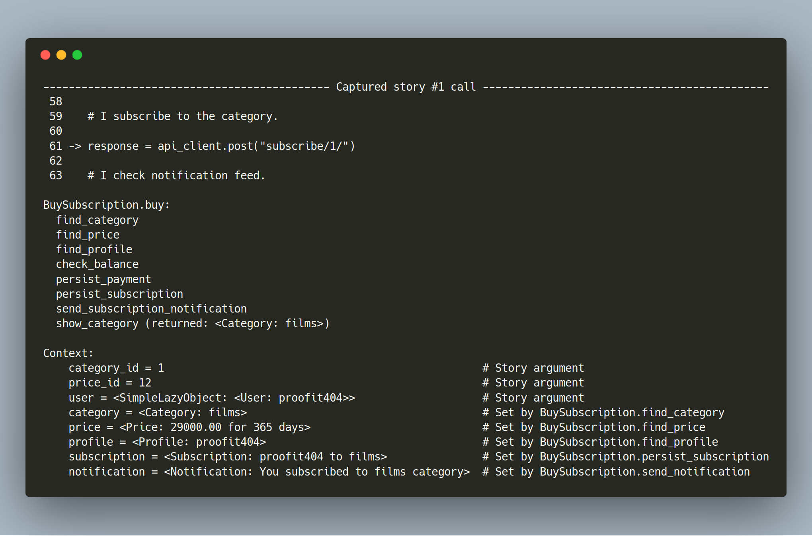

# Stories pytest

[](https://dev.azure.com/proofit404/stories-pytest/_build/latest?definitionId=10&branchName=master)
[](https://dev.azure.com/proofit404/stories-pytest/_build/latest?definitionId=10&branchName=master)
[](https://pypi.org/project/stories-pytest)
[](https://pypi.org/project/stories-pytest)

Pytest reporter for stories executed during the test.

**[Documentation](https://proofit404.github.io/stories-pytest) |
[Source Code](https://github.com/proofit404/stories-pytest) |
[Task Tracker](https://github.com/proofit404/stories-pytest/issues)**



A paragraph of text explaining the goal of the library…

This plugin is enabled by default.

To disable it add `-p no:stories` argument to the `pytest` command.

## Pros

This pytest plugin provides additional report for failed tests.

This report contains:

1. Stories executed by the failed test in chronological order.
2. Precise line number of the test function which caused execution of the
   particular story.
3. Execution path of each story.
4. State of each story.

## Example

A line of text explaining snippet below…

```pycon

>>> from stories_pytest import *

```

## Questions

If you have any questions, feel free to create an issue in our
[Task Tracker](https://github.com/proofit404/stories-pytest/issues). We have the
[question label](https://github.com/proofit404/stories-pytest/issues?q=is%3Aopen+is%3Aissue+label%3Aquestion)
exactly for this purpose.

## Enterprise support

If you have an issue with any version of the library, you can apply for a paid
enterprise support contract. This will guarantee you that no breaking changes
will happen to you. No matter how old version you're using at the moment. All
necessary features and bug fixes will be backported in a way that serves your
needs.

Please contact [proofit404@gmail.com](mailto:proofit404@gmail.com) if you're
interested in it.

## License

`stories-pytest` library is offered under the two clause BSD license.

<p align="center">&mdash; ⭐️ &mdash;</p>
<p align="center"><i>The `stories-pytest` library is part of the SOLID python family.</i></p>
